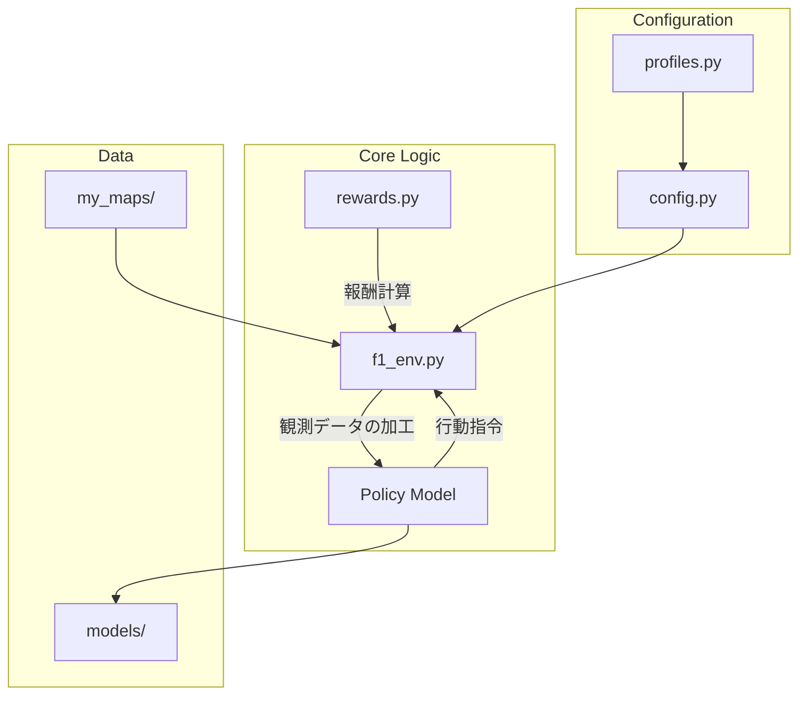

# 🏎️ F1Tenth AI Racing Project

[](https://opensource.org/licenses/MIT)
[](https://www.python.org/downloads/)
[]()

**Deep Reinforcement Learning × LiDAR-based Autonomous Racing**

F1Tenthシミュレータ上で、**LiDARセンサーのみ**を頼りに高速かつ安定した自律走行を実現するAI（PPO）を開発するプロジェクトです。
シミュレーションでの学習から実機（Jetson）へのデプロイまでを考慮した、開発者にとって一貫性のあるワークフローを提供します。

---

## 🏗️ システムアーキテクチャ

本プロジェクトは、機能ごとにモジュール化されており、新しい報酬関数やネットワーク構造の導入が容易な設計になっています。



### 主要コンポーネント
- **`src/f1_env.py`**: シミュレータをGymインターフェースにラップ。LiDARのダウンサンプリング、フレーム積層、車両状態の正規化を一括管理します。
- **`src/rewards.py`**: 報酬計算のロジックを集約。`RewardConfig` クラスにより、学習パラメータを柔軟に変更可能です。
- **`src/cnn_policy.py`**: LiDAR点群の空間的な連続性を捉えるための1次元畳み込み（Conv1D）ネットワーク。
- **`src/config.py`**: プロジェクト全体のマスター設定ファイル。環境変数による動的な上書きをサポートします。

---

## 🚀 クイックスタート (Docker)

Dockerを使用することで、GPU環境を含めたセットアップが最短3分で完了します。

### 1. 環境の起動
```bash
# イメージのビルドとコンテナの起動
docker compose up -d

# コンテナ内に入る
docker compose exec f1-sim-latest bash
```

### 2. 学習の実行 (最新のCNNモデル例)
```bash
# 実験用スクリプトの実行
bash scripts/experiments/run_exp40.sh
```

### 3. 進捗確認
別のターミナルで TensorBoard を起動し、ブラウザで `localhost:6006` を開いてください。
```bash
tensorboard --logdir logs --host 0.0.0.0
```

---

## 👨‍💻 開発者ガイド (How-to)

新しいプログラマがプロジェクトを拡張するためのガイドです。

### 新しい実験 (Experiment) を追加する
1. `src/config_expXX.py` を作成（既存のファイルをコピー）。
2. `scripts/experiments/run_expXX.sh` を作成し、必要な環境変数を設定。
3. `python3 scripts/train.py` を呼び出す際に、モデル名やステップ数を指定。

### 報酬関数をカスタマイズする
`src/rewards.py` の `calculate_reward` 関数を編集します。LiDARの角度インデックス（1080点/270°）の対応表がコメントに記載されており、特定の方向（前方、左右など）へのペナルティ/ボーナスを簡単に追加できます。

### 新しいマップを追加する
`my_maps/` ディレクトリに `.pgm` (画像) と `.yaml` (メタデータ) を配置し、`config.py` の `MAP_PATH` を更新します。

---

## 🛠️ ハードウェア要件

- **OS**: Linux (Ubuntu 20.04/22.04 推奨)
- **GPU**: NVIDIA GPU (CUDA対応) + `nvidia-container-toolkit`
- **実機同期**: 制御周波数は実機Hokuyoに合わせて **40Hz** に設定されています。

---

## 💡 技術的ハイライト

- **Sim-to-Real 観測**: 360°のシミュレーションデータを、実機同様の **270°マスク** に制限して学習。
- **高解像度観測**: 1440本のLiDARビームを216点に処理（従来の2倍）。
- **Frame Stacking**: 4フレームを積層し、AIに時間的な変化（速度ベクトル）を認識させます。

---

## ⚠️ トラブルシューティング

- **CUDAエラー**: コンテナ外で `nvidia-smi` が動作することを確認し、`docker-compose.yml` の `deploy.resources.reservations.devices` 設定を確認してください。
- **学習が収束しない**: `MIN_SPEED` が高すぎないか確認してください。物理的に曲がれない速度を強いると、学習が停滞します。
- **モデルロード失敗**: 観測次元（LiDAR点数 + 状態数）が変わるとロードできません。

---

## 📝 バージョン情報
- **最終更新**: 2026-05-01
- **最新フェーズ**: フェーズ12（CNNポリシー）
- **ライセンス**: MIT
