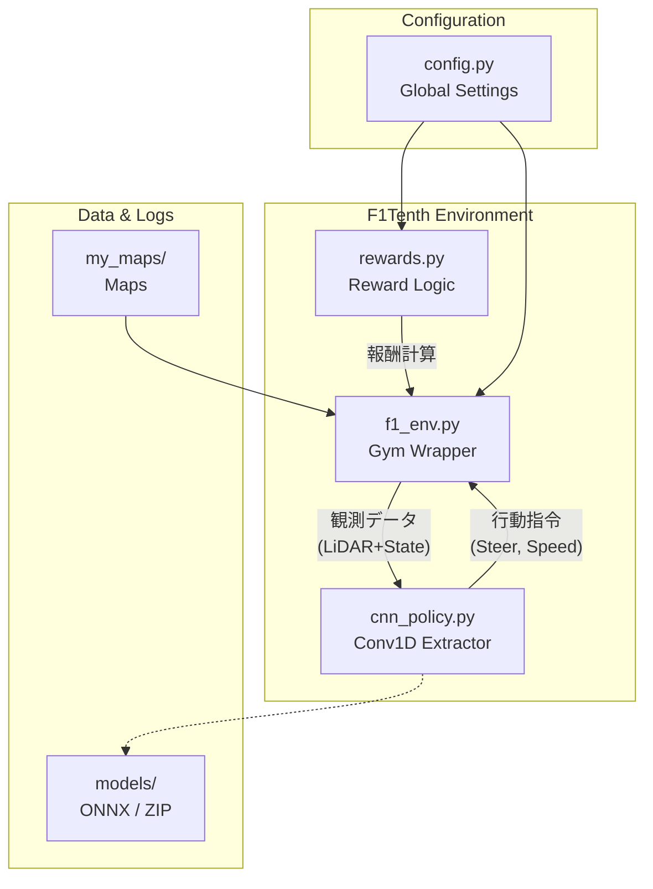

# 🏎️ F1Tenth AI Racing Project

[](https://opensource.org/licenses/MIT)
[](https://www.python.org/downloads/)
[]()
[]()

> **Deep Reinforcement Learning × LiDAR-based Autonomous Racing**
>
> F1Tenthシミュレータ上で、**LiDARセンサーのみ**を頼りに高速かつ安定した自律走行を実現するAI（PPOアルゴリズム）を開発するプロジェクトです。
> 単なるシミュレーション上のスコアアタックにとどまらず、**実機（Jetson搭載車両）へのデプロイ（Sim-to-Real）**を強く意識した一貫性のあるワークフローを提供します。

---

## ✨ 技術的ハイライト (Key Features)

本プロジェクトでは、より高度な空間認識と実機適応を目指し、以下の独自拡張を施しています。

*   🧠 **1D-CNN (Conv1D) ポリシー**: 従来のMLPの限界を突破。LiDAR点群の空間的な連続性と、フレーム積層による時間的な動きを正確に抽出。
*   🎯 **Sim-to-Real 観測**: 360°のデータを実機(Hokuyo URG)同様の **270°マスク** に制限して学習。
*   🔍 **高解像度LiDAR**: 1440本のビームを処理し、微細な壁の凹凸や狭いコーナーの隙間を認識。
*   ⏱️ **サブステップ観測更新**: `ACTION_REPEAT` 中のサブステップごとに観測バッファを更新し、極めて高い時間分解能で加速・減速を制御。
*   📊 **統計的報酬設計**: マップ固有の壁距離の中央値（p50/p75）を基準とした正規化により、様々な道幅のコースに柔軟に適応。

---

## 🏗️ システムアーキテクチャ

システムは機能ごとに疎結合にモジュール化されており、新しいアイデア（報酬関数やネットワーク構造）の導入が容易です。



---

## 📂 ディレクトリ構成

```text
f1tenth-rl-project/
├── scripts/
│   ├── train.py          # 学習実行スクリプト
│   ├── evaluate.py       # モデル評価スクリプト
│   └── enjoy_wide.py     # 走行動画（mp4/gif）生成スクリプト
├── src/
│   ├── f1_env.py         # F1Tenth Gym 環境ラッパー（前処理・積層）
│   ├── rewards.py        # 報酬関数定義ロジック
│   ├── cnn_policy.py     # カスタムCNN（Conv1D）ネットワーク構造
│   └── config.py         # ハイパーパラメータ・環境設定マスター
├── my_maps/              # カスタムマップデータ (.pgm, .yaml)
├── EXPERIMENT_PLAN.md    # 実験ログ・考察・知見の蓄積（最重要ドキュメント）
├── EXPERIMENT_REPORT.md  # 開発フェーズごとの総括レポート
└── docker-compose.yml    # GPU対応コンテナ環境定義
```

---

## 🚀 クイックスタート (Docker)

Dockerを使用することで、煩雑なCUDA環境の構築をスキップし、最短3分で学習を開始できます。

### 1. 環境の起動
```bash
# イメージのビルド(初回のみ)
docker compose build

# コンテナの起動
docker compose up -d

# コンテナ内シェルへのアクセス
docker compose exec f1-sim-latest bash
```

### 2. 学習の実行
最新の設定（CNNモデル）で学習を開始します。
```bash
python3 scripts/train.py --model my_first_model --steps 5000000
```
別のターミナルで `tensorboard --logdir logs --host localhost` を実行すれば、ブラウザからリアルタイムで進捗を確認できます。

### 3. 評価と可視化
学習したモデルの完走率をテストし、走行の様子を動画化します。
```bash
# 20エピソードのテスト走行
python3 scripts/evaluate.py --model my_first_model --episodes 20

# 走行動画の生成
python3 scripts/enjoy_wide.py --model my_first_model --save /workspace/gif/my_first_model.mp4
```

---

## 👨‍💻 開発者向けガイド

*   **報酬関数のカスタマイズ**: `src/rewards.py` を編集します。現在はマップの実測統計値に基づく正規化を行っています。新しいマップを追加する際は、マップ幅に応じた定数の見直しを推奨します。
*   **過去の知見の活用**: 新しい実験を始める前に、必ず [EXPERIMENT_PLAN.md](EXPERIMENT_PLAN.md) を一読してください。過去に経験した「局所解の性質」「報酬ハッキングの事例」などが詳細に記録されています。

---

## ⚠️ 既知のトラブルシューティング・注意事項

*   **報酬ハッキング**: 強すぎる「前進報酬」や不適切な「最大距離ボーナス」は、AIが広い場所でその場回転し続ける挙動を誘発します。これを防ぐために `rewards.py` に `spin_penalty` が導入されています。
*   **物理エンジンの警告**: 学習初期に `RuntimeWarning: overflow encountered in multiply` が出ることがありますが、AIが極端な操作を試した際の物理エンジンの悲鳴です。`nan_to_num` ガードで処理されているため、学習自体は正常に継続します。
*   **CUDAエラー**: コンテナ外で `nvidia-smi` が動作しているか、`docker-compose.yml` のリソース設定が正しいかを確認してください。

---

## 📝 バージョン情報
*   **最終更新**: 2026-05-11
*   **最新フェーズ**: フェーズ13（CNNの洗練・極狭路マップへの最適化）
*   **ライセンス**: MIT
