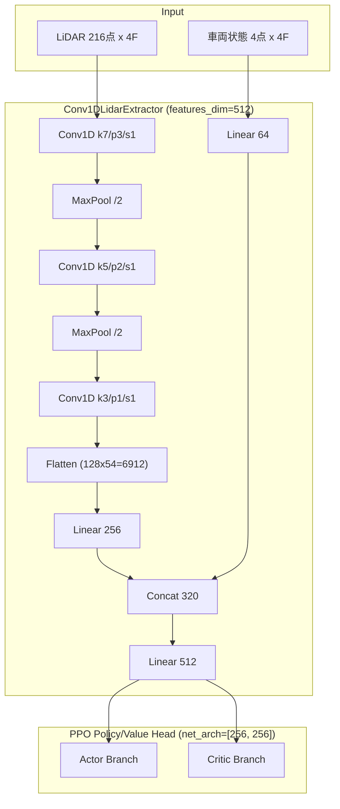

# F1TENTH 強化学習システム 技術整理まとめ

## ■ 概要
本プロジェクトは、LiDARセンサを用いたF1TENTH車両の自律走行を強化学習で実現する。

### 現在の構成
- センサ：Hokuyo LiDAR（270°）
- 入力：LiDAR（ダウンサンプリング）＋フレームスタック＋車両状態＋追加特徴
- モデル：**Conv1D + MLP（CNN特徴抽出器）**
- アルゴリズム：PPO
- 実行環境：Jetson Orin Nano

---

## ■ PPOとは
PPO（Proximal Policy Optimization）は強化学習アルゴリズムであり、  
ニューラルネットの「学習方法」を指す。

### 構造
入力 → ニューラルネット → 行動  
　　　　　　　↑  
　　　　　 PPOで学習

---

## ■ 現在のボトルネック（解決済み）
- ~~前処理の不安定性~~ → **0-1反転正規化に修正 ✅**
- ~~入力設計の不十分さ~~ → **front_dist / min_dist 特徴を追加 ✅**
- ~~LiDAR構造未活用（MLPの限界）~~ → **Conv1D特徴抽出器を導入 ✅**

※ アルゴリズム自体は問題ではない

---

## ■ LiDAR前処理（実装済み）

### 問題点（旧）
- inf / NaN 未処理
- クリッピングなし
- Z-score正規化（不安定）

---

### 実装済み前処理（development-plan.md準拠）

```python
def preprocess_lidar(lidar, max_range=30.0):
    import numpy as np

    lidar = np.array(lidar)

    lidar = np.nan_to_num(lidar, nan=max_range)
    lidar[np.isinf(lidar)] = max_range
    lidar = np.clip(lidar, 0.0, max_range)

    lidar = lidar / max_range
    lidar = 1.0 - lidar   # ← 近い壁=1.0, 遠い空間=0.0

    return lidar
```

実装場所: `src/f1_env.py` の `_get_obs()` 内

---

### 数値条件
- 範囲：0.0 ～ 1.0
- NaN：なし（reset/step でクリーニング後に適用）
- inf：なし

---

## ■ 正規化 vs 正則化

| 用語 | 内容 |
|------|------|
| 正規化 | 入力スケール調整 |
| 正則化 | 過学習防止 |

優先度：
- 正規化：**実装完了**
- 正則化：後回し

---

## ■ 入力設計（実装済み）

### 改善案（実装済み）
- 前方距離（`front_dist`）: `1.0 - clip(min(s[285:525])) / 30.0`
- 最小距離（`min_dist`）: `1.0 - clip(min(s)) / 30.0`

`config.py`: `INCLUDE_EXTRA_FEATURES = True` で有効

---

### 構成（現状）
```
LiDAR → clip + 0-1反転 → フレームスタック
                        ↗ front_dist スカラー追加
                        ↗ min_dist スカラー追加
                        ↗ 車両状態 [vel, steer]
                                    ↓
                              Conv1D特徴抽出器
                                    ↓
                               MLP(PPO)
```

---

## ■ モデル構造（実装済み）

### 現状（EXP-47構成）
LiDAR空間特徴を抽出する **Conv1D** と、車両状態を処理する **MLP** のハイブリッド構成。



*   **実装場所**: `src/cnn_policy.py` (`Conv1DLidarExtractor`)
*   **特徴**:
    *   **Paddingの利用**: 各畳み込み層で `padding` を使用し、長さの欠落を防いでいる（Flatten前は 54点）。
    *   **広域→局所**: カーネルサイズを `7→5→3` と段階的に小さくし、広い視野から詳細な形状へ抽出。

---

## ■ アーキテクチャ・レビューと改善案（2026/05/04記録）

ユーザーによる詳細レビューに基づき、以下の課題と改善案を整理。

### 課題
1.  **時間情報の扱いが弱い**: フレームスタックをチャンネルとして Conv1D で混ぜているため、厳密な時系列（動き）の学習が不十分。
2.  **解像度依存**: `Flatten` 後の次元が入力解像度（LiDAR点数）に依存しており、設定変更に弱い。
3.  **FC層のパラメータ肥大**: `Flatten` 直後の全結合層が大きく、Jetson等のエッジデバイスでの負荷要因。

### 改善提案
| 優先度 | 項目 | 内容 | 効果 |
| :--- | :--- | :--- | :--- |
| **A** | **AdaptiveAvgPool1d 導入** | Flatten 前に GAP を挿入 | パラメータ削減、解像度非依存化 |
| **B** | **net_arch 見直し** | `[256, 256]` からの最適化 | 推論速度向上、過学習抑制 |
| **C** | **時系列モデルの導入** | LSTM / GRU / Temporal Conv | 動的な物体回避、速度予測の向上 |

---

---

## ■ 報酬設計

### 現状要素
- 前方距離
- 速度
- 壁距離
- 進行距離

---

### 注意
- 速度偏重 → 衝突
- 安全偏重 → 遅い

---

## ■ PPO以外

### SAC
- 高性能
- 不安定

### 結論
現段階ではPPOが最適

---

| # | 項目 | 状態 |
|---|------|------|
| 1 | 前処理修正 | ✅ 完了 |
| 2 | 入力設計改善 (front_dist/min_dist) | ✅ 完了 |
| 3 | CNN導入 (Conv1D特徴抽出器) | ✅ 完了 |
| 4 | 報酬調整 | ✅ 実装済み (rewards.py) |
| 5 | PPO調整 (net_arch拡大 [256, 256]) | ✅ 完了 (EXP-47) |
| 6 | **モデル軽量化・柔軟性向上 (GAP等)** | ⬜ 次のアクション |
| 7 | **時系列処理の強化 (LSTM等)** | ⬜ 検討中 |
| 8 | SAC検討 | ⬜ 後回し |

---

## ■ 結論

改善の本質は：

「アルゴリズムではなく設計」

特に重要：
- 前処理（**実装完了**）
- 入力設計（**実装完了**）
- モデル構造（**Conv1D実装完了**）

---

## ■ 次のアクション

- [ ] Dockerコンテナ内で再学習実行
  ```bash
  python3 scripts/train.py
  ```
- [ ] TensorBoardで旧MLP vs 新CNNモデルを比較
- [ ] enjoy_wide.py で走行動画を確認
- [ ] 衝突頻度・平均報酬の定量評価