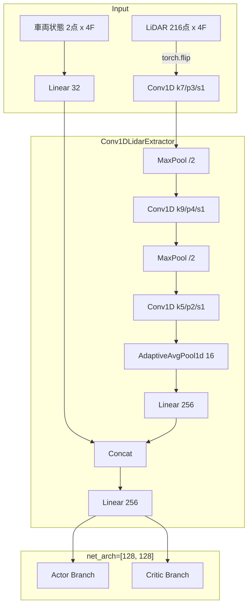

# F1TENTH 強化学習システム 技術整理まとめ

## ■ 概要
本プロジェクトは、LiDARセンサを用いたF1TENTH車両の自律走行を強化学習で実現する。

### 現在の構成
- センサ：Hokuyo LiDAR（270°）
- 入力：LiDAR（ダウンサンプリング）＋フレームスタック＋車両状態＋追加特徴
- モデル：**Conv1D + MLP（CNN特徴抽出器）**
- アルゴリズム：PPO
- 実行環境：Jetson Orin Nano

---

## ■ PPOとは
PPO（Proximal Policy Optimization）は強化学習アルゴリズムであり、  
ニューラルネットの「学習方法」を指す。

### 構造
入力 → ニューラルネット → 行動  
　　　　　　　↑  
　　　　　 PPOで学習

---

## ■ 現在のボトルネック（解決済み）
- ~~前処理の不安定性~~ → **0-1反転正規化に修正 ✅**
- ~~入力設計の不十分さ~~ → **front_dist / min_dist 特徴を追加 ✅**
- ~~LiDAR構造未活用（MLPの限界）~~ → **Conv1D特徴抽出器を導入 ✅**
- ~~時間情報の欠落~~ → **torch.flip および サブステップ観測更新を導入 ✅**

---

## ■ LiDAR前処理（実装済み）

### 実装済み前処理（development-plan.md準拠）

```python
def preprocess_lidar(lidar, max_range=30.0):
    import numpy as np
    lidar = np.array(lidar)
    lidar = np.nan_to_num(lidar, nan=max_range)
    lidar[np.isinf(lidar)] = max_range
    lidar = np.clip(lidar, 0.0, max_range)
    lidar = lidar / max_range
    lidar = 1.0 - lidar   # ← 近い壁=1.0, 遠い空間=0.0
    return lidar
```

実装場所: `src/f1_env.py` の `_get_obs()` 内

---

## ■ 入力設計（実装済み）

### 改善案（実装済み）
- 前方距離（`front_dist`）: `1.0 - clip(min(s[285:525])) / 30.0`
- 最小距離（`min_dist`）: `1.0 - clip(min(s)) / 30.0`

`config.py`: `INCLUDE_EXTRA_FEATURES = True` で有効

---

## ■ モデル構造（最新：EXP-48構成）

LiDAR空間特徴を抽出する **Conv1D** と、車両状態を処理する **MLP** のハイブリッド構成。



*   **実装場所**: `src/cnn_policy.py` (`Conv1DLidarExtractor`)
*   **特徴**:
    *   **AdaptiveAvgPool1d**: 入力解像度に依存しない堅牢な設計。
    *   **時間順序の正常化**: `torch.flip` により物理的な因果関係を正しく学習。

---

## ■ 報酬設計 (最新ロジック)

### センターライン進捗報酬（最新：EXP-50構成）
- **進捗（Progress）**: ウェイポイント・インデックスの差分を直接評価。逆走・停滞を物理的に排除。
- **前進条件付き報酬**: 速度報酬とステアリング安定ボーナスを「前進中（delta > 0）」のみに制限。
- **ペナルティ専用安全スコア**: 壁接近のみを減点。安全圏での加点を廃止し、停滞ハッキングを防止。
- **高精度角速度ペナルティ**: 1ステップあたりの角度変化に基づくスピン防止。
- **生存報酬ゼロ化**: 受動的な報酬を廃止し、能動的なコース進捗のみを評価。

---

## ■ 進捗状況まとめ

| # | 項目 | 状態 |
|---|------|------|
| 1 | 前処理修正 | ✅ 完了 |
| 2 | 入力設計改善 (front_dist/min_dist) | ✅ 完了 |
| 3 | CNN導入 (Conv1D) | ✅ 完了 |
| 4 | 報酬調整 (センターライン進捗/ハッキング根絶) | ✅ 完了 |
| 5 | モデル軽量化・柔軟性向上 (GAP導入) | ✅ 完了 |
| 6 | 時間軸反転バグの修正 | ✅ 完了 |
| 7 | サブステップ観測更新の実装 | ✅ 完了 |
| 8 | 報酬ロジックのユニットテスト整備 | ✅ 完了 |
| 9 | 残差強化学習 (Residual RL) | ✅ 完了 |

---

## ■ 次のフェーズ：残差強化学習 (Residual RL)

学習速度と安定性を劇的に向上させるため、古典制御をベースとした「残差学習」へ移行する。

### 1. コンセプト
- **基本行動**: Pure Pursuit (純追従制御) がレーシングラインに基づき計算。
- **RLの役割**: ベース行動に対する「補正値（Residual）」のみを学習。
- **メリット**: ステップ 0 から完走可能。RLはラップタイム最適化に特化できる。

### 2. 実装項目
- [x] `src/controllers/pure_pursuit.py`: ベース制御器の実装
- [x] `src/config.py`: `USE_RESIDUAL_RL` およびスケール設定の追加
- [x] `src/f1_env.py`: `step()` 内で `final_action = base_action + residual` を計算
- [x] `src/rewards.py`: ベースラインに対する向上を評価する報酬の調整

---

## ■ 次のアクション

- [ ] **新規学習の開始** (`scripts/train.py`): ハッキング癖をリセットするためゼロから学習
- [ ] TensorBoard で `reward/progress` と `reward/yaw_rate_penalty` を重点監視
- [ ] 学習完了後のベンチマーク評価 (`scripts/evaluate.py`)